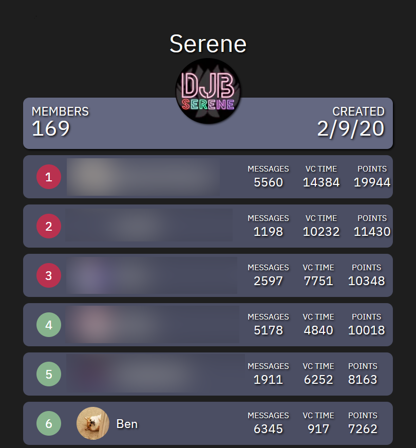

<div id="top"></div>

[![Contributors][contributors-shield]][contributors-url]
[![Forks][forks-shield]][forks-url]
[![Stargazers][stars-shield]][stars-url]
[![Issues][issues-shield]][issues-url]
[![MIT License][license-shield]][license-url]
[![LinkedIn][linkedin-shield]][linkedin-url]

<div align="center">
  <a href="https://github.com/benwang2/Lotus">
    
  </a>

  <h3 align="center">Lotus</h3>

  <p align="center">
    A service that tracks user activity and facilitates organizing events within small communities.
  </p>
</div>


## About The Project

This project is powered by Discord&#46;py, Flask and MySQL. It is composed of three core components: the Discord bot, the Flask web server, and the MySQL Database.

### Discord Bot
The Discord bot tracks certain events and updates the MySQL database. The events include: messages sent, joining and leaving voice channels, and profile picture changes.

The bot also:
* allows users to create, list, and delete reminders
* enables developers to execute SQL in Discord
* integrates with <a href="https://challonge.com">Challonge</a> to create tournaments
* automates cleaning specific text channels
* uses rich presence to display Rae Dunn quotes

### Flask Web Server
The web server is powered by Flask and displays the 50 most active users in a community. It also implements an API endpoint `/json/<guild_id>` that returns json data used for displaying the most active users.

<div align="center">

</div>
<br/>

### MySQL Database
The database has one schema, `discord`, and three tables, `reminders`, `guilds`, `users`.

`reminders` contains information for reminders scheduled by users, and can be created with this SQL command.

`guilds` contains information for all the guilds including: guild id, name, number of members, creation date, guild icon, autodelete channel ids, and the cooldown for giving points for messages.

`users` contains any information pertaining to users including: guild, member id, username, profile picture, number of points, number of messages sent, minutes spent in voice channels, timestamp of last message, timestamp of joining vc.

<p align="right">(<a href="#top">back to top</a>)</p>

## Getting Started

### Dependencies

* <a href="https://www.python.org/">Python</a>
* <a href="https://github.com/pallets/flask/">Flask</a>
* <a href="https://github.com/Rapptz/discord.py">Discord.py</a>
* <a href="https://www.mysql.com/">MySQL</a>

### Setting Up

Configure `discord/config.py` and **__MYSQL_CONFIG** in `website/main.py` with your credentials.

The following commands can be used to set up the MySQL database.
```sql
CREATE SCHEMA discord;

USE discord;

CREATE TABLE reminders (
    member_id BIGINT NOT NULL,
    reminder_id VARCHAR(6) NOT NULL,
    channel_id BIGINT NOT NULL,
    message VARCHAR(250) NOT NULL,
    time BIGINT NOT NULL,
    PRIMARY KEY(reminder_id)
);

CREATE TABLE guilds (
    guild_id BIGINT NOT NULL,
    name VARCHAR(100) NOT NULL,
    members INT NOT NULL,
    created DATE NOT NULL,
    icon VARCHAR(2083) NOT NULL,
    autodelete JSON,
    PRIMARY KEY (guild_id)
)

CREATE TABLE users (
    guild_id BIGINT NOT NULL,
    member_id BIGINT NOT NULL,
    username CHAR(32) NOT NULL,
    pfp VARCHAR(2083) NOT NULL,
    points INT DEFAULT 0,
    text INT DEFAULT 0,
    voice INT DEFAULT 0,
    last_message BIGINT,
    joined_vc BIGINT
)
```

<p align="right">(<a href="#top">back to top</a>)</p>


<!-- MARKDOWN LINKS & IMAGES -->
<!-- https://www.markdownguide.org/basic-syntax/#reference-style-links -->
[contributors-shield]: https://img.shields.io/github/contributors/benwang2/Lotus.svg?style=for-the-badge
[contributors-url]: https://github.com/benwang2/Lotus/graphs/contributors
[forks-shield]: https://img.shields.io/github/forks/benwang2/Lotus.svg?style=for-the-badge
[forks-url]: https://github.com/benwang2/Lotus/network/members
[stars-shield]: https://img.shields.io/github/stars/benwang2/Lotus.svg?style=for-the-badge
[stars-url]: https://github.com/benwang2/Lotus/stargazers
[issues-shield]: https://img.shields.io/github/issues/benwang2/Lotus.svg?style=for-the-badge
[issues-url]: https://github.com/benwang2/Lotus/issues
[license-shield]: https://img.shields.io/github/license/benwang2/Lotus.svg?style=for-the-badge
[license-url]: https://github.com/benwang2/Lotus/blob/master/LICENSE.txt
[linkedin-shield]: https://img.shields.io/badge/-LinkedIn-black.svg?style=for-the-badge&logo=linkedin&colorB=555
[linkedin-url]: https://linkedin.com/in/benwang3
[product-screenshot]: images/screenshot.png